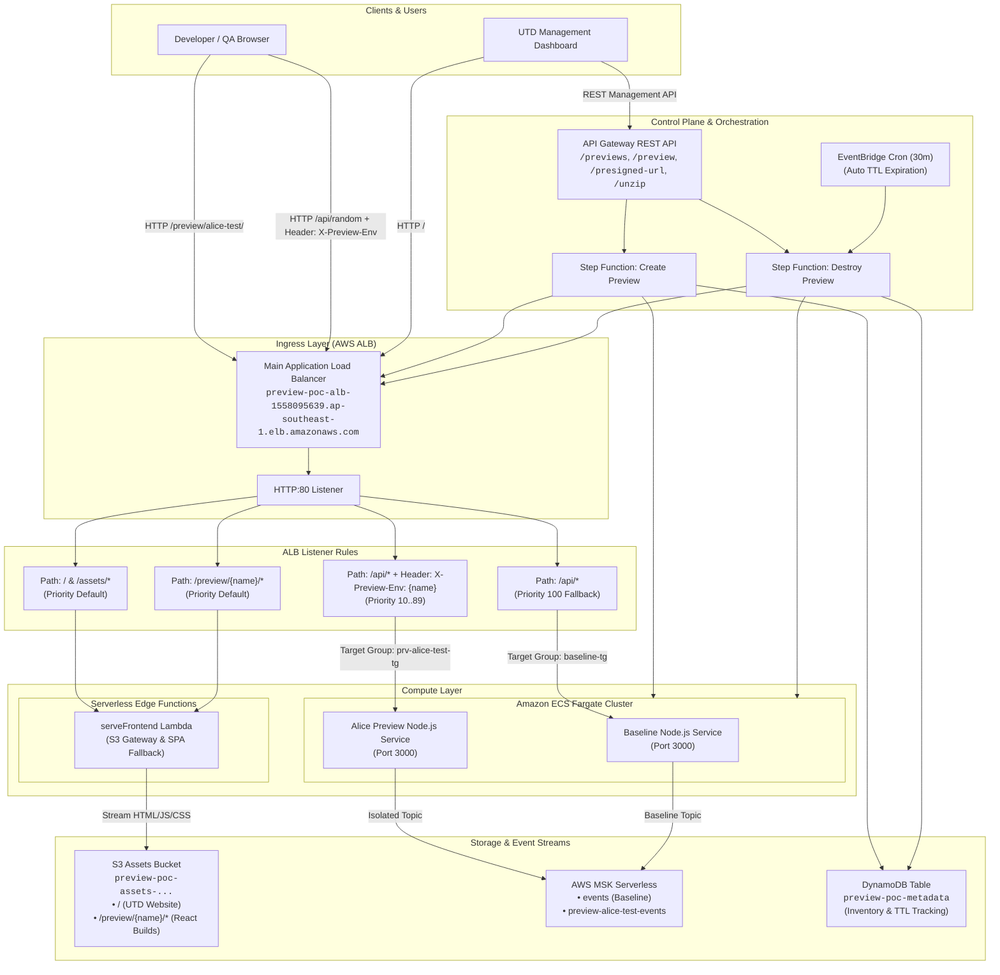

# Self-Service Full-Stack Preview Environments (POC)

An autonomous, self-service platform for spinning up ephemeral, isolated full-stack preview environments sharing a common Application Load Balancer (ALB) and AWS MSK Serverless cluster.

---

## 1. Architecture Diagram

Generated automatically from the Terraform infrastructure code using **TerraVision**:


- **Interactive Architecture Viewer**: [Open in Browser](http://preview-poc-alb-1558095639.ap-southeast-1.elb.amazonaws.com/terravision.html) *(or view local `terravision.html`)*
- **Editable draw.io Diagram**: [`architecture.drawio`](architecture.drawio) *(open in draw.io / diagrams.net / Lucidchart)*

### High-Level Topology



---

## 2. Key Endpoints & Resources

| Component | Endpoint / Resource |
| :--- | :--- |
| **UTD Website (Public Web)** | [http://preview-poc-alb-1558095639.ap-southeast-1.elb.amazonaws.com/](http://preview-poc-alb-1558095639.ap-southeast-1.elb.amazonaws.com/) |
| **UTD Website (Local Dev)** | `npm.cmd run dev` -> `http://localhost:5173` |
| **Active Preview Frontend** | [http://preview-poc-alb-1558095639.ap-southeast-1.elb.amazonaws.com/preview/alice-test/](http://preview-poc-alb-1558095639.ap-southeast-1.elb.amazonaws.com/preview/alice-test/) |
| **Node.js Baseline API** | [http://preview-poc-alb-1558095639.ap-southeast-1.elb.amazonaws.com/api/random](http://preview-poc-alb-1558095639.ap-southeast-1.elb.amazonaws.com/api/random) |
| **Node.js Preview API** | Send `X-Preview-Env: alice-test` header to `/api/random` |
| **MSK Serverless Cluster** | `arn:aws:kafka:ap-southeast-1:470972348114:cluster/preview-poc-msk-serverless/848b8966-347f-4362-a67c-70fdcbe7caf9-s1` |
| **ECS Cluster** | `preview-poc-cluster` |
| **S3 Assets Bucket** | `preview-poc-assets-20260924162153478900000001` |
| **DynamoDB Metadata Table** | `preview-poc-metadata` |
| **API Gateway Endpoint** | `https://zb6q33vbbe.execute-api.ap-southeast-1.amazonaws.com/prod` |

---

## 3. How It Works

### 3.1 Header-Based Routing (Backend)
- All traffic routes through a single shared Application Load Balancer (ALB).
- When a client issues an API call (e.g., `/api/random`):
  - If header `X-Preview-Env: <preview-name>` is present, the ALB matches a listener rule in the reserved priority range (10..89) and forwards to that preview's isolated ECS Fargate container.
  - If no header is present, it falls back to the baseline rule (Priority 100), forwarding to the baseline container.

### 3.2 Path-Based Static Frontend Serving (S3 + Lambda)
- React builds are packaged as zip files and uploaded to S3.
- The `unzipS3Files` Lambda extracts them to `preview/{preview-name}/`.
- The `serveFrontend` Lambda acts as an ALB target group handler:
  - Serves static assets (`.html`, `.js`, `.css`, `.svg`, etc.) with correct MIME types and `Cache-Control: no-cache, must-revalidate`.
  - Implements SPA client-side routing fallback to `preview/{name}/index.html` for deep links.
  - Serves the compiled UTD Management Dashboard at the ALB root (`/`).

### 3.3 Kafka MSK Serverless Topic Isolation
- Services communicate with MSK Serverless using topic prefixing:
  - Baseline service produces/consumes on `events`.
  - Preview environments produce/consumes on `preview-{previewName}-events`.

---

## 4. Walkthrough Guide: Using the Prototype

### Option A: Using the UTD Web Dashboard (Recommended)

1. **Access the Dashboard**:
   Open [http://preview-poc-alb-1558095639.ap-southeast-1.elb.amazonaws.com/](http://preview-poc-alb-1558095639.ap-southeast-1.elb.amazonaws.com/) in your browser.
2. **Create a Preview Environment**:
   - In the **Create Preview Environment** card, enter a name (e.g., `feat-checkout`).
   - Click **Create Preview Environment**.
   - An AWS Step Function provisions the ECS Task Definition, ALB Target Group, Listener Rule, and Fargate Service. Status transitions to `ACTIVE` in ~30–45 seconds.
3. **Upload and Deploy a React Build**:
   - In the **Deploy React Build to Preview** card, select your preview from the dropdown.
   - Choose a zip file containing your compiled React build (or use the included `preview-frontend-build.zip`).
   - Click **Upload & Deploy to Preview**.
   - The dashboard requests a presigned S3 upload URL, uploads the zip, and triggers the unzipper Lambda.
4. **Access the Preview Frontend**:
   - Click **Open Preview** to view the deployed React app at `http://.../preview/{name}/`.
5. **Test Backend Isolation**:
   - Click **Test Backend API** to test the Node.js backend container responding with `X-Preview-Env`.
6. **Teardown**:
   - Click **Destroy** next to any preview to run the automated teardown Step Function (deletes ALB rule, stops ECS task, and deletes target group).

---

### Option B: Command-Line Interface (CLI / curl)

#### 1. List Previews
```bash
curl -s "https://zb6q33vbbe.execute-api.ap-southeast-1.amazonaws.com/prod/previews"
```

#### 2. Create a Preview
```bash
curl -s -X POST "https://zb6q33vbbe.execute-api.ap-southeast-1.amazonaws.com/prod/preview" \
  -H "Content-Type: application/json" \
  -d "{\"previewName\":\"carol-feat\",\"imageTag\":\"node-backend\"}"
```

#### 3. Upload & Deploy React Build
```bash
# Get presigned URL
curl -s "https://zb6q33vbbe.execute-api.ap-southeast-1.amazonaws.com/prod/presigned-url?filename=preview-frontend-build.zip&previewName=carol-feat"

# Upload zip to returned uploadUrl
curl -s -X PUT -T preview-frontend-build.zip -H "Content-Type: application/zip" "<uploadUrl>"

# Trigger unzip
curl -s -X POST "https://zb6q33vbbe.execute-api.ap-southeast-1.amazonaws.com/prod/unzip" \
  -H "Content-Type: application/json" \
  -d "{\"zipKey\":\"deploy/carol-feat/preview-frontend-build.zip\",\"previewName\":\"carol-feat\"}"
```

#### 4. Test API Routing
```bash
# Baseline route (no header) -> Returns previewEnv: "baseline"
curl http://preview-poc-alb-1558095639.ap-southeast-1.elb.amazonaws.com/api/random

# Preview route (with header) -> Returns previewEnv: "carol-feat"
curl -H "X-Preview-Env: carol-feat" http://preview-poc-alb-1558095639.ap-southeast-1.elb.amazonaws.com/api/random
```

#### 5. Destroy Preview
```bash
curl -s -X DELETE "https://zb6q33vbbe.execute-api.ap-southeast-1.amazonaws.com/prod/preview/carol-feat"
```

---

## 5. Development & Building

### Local UTD Development Server
```bash
npm.cmd install
npm.cmd run dev
```
Open `http://localhost:5173`.

### Recompiling the UTD Dashboard
```bash
npm.cmd run build
```
Build output is in `dist/`.

### Regenerating Architecture Diagram with TerraVision
```bash
powershell -ExecutionPolicy Bypass -File run-terravision.ps1
```
Outputs:
- `architecture.png`: Rendered architecture diagram.
- `terravision.html`: Interactive browser visualizer with pan/zoom.
- `architecture.drawio`: Editable diagram file for draw.io / Lucidchart.
