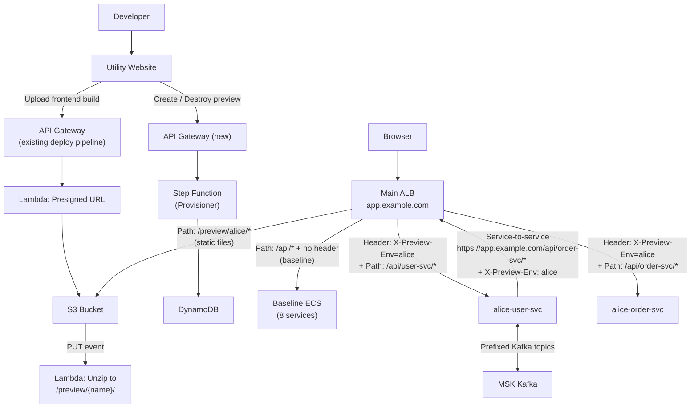
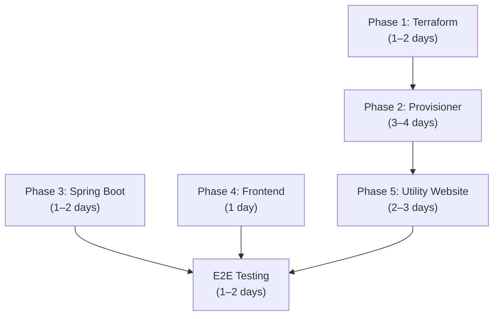

# Preview Environments POC — Final Implementation Plan

## 1. Project Context

### Problem
Multiple developers need to test their code on the deployed dev environment simultaneously. Currently only one developer can deploy and test at a time — a single shared environment creates bottlenecks.

### Solution
A **self-service preview environment system** where any developer can spin up an isolated full-stack preview of their changes from a utility website — no AWS console access needed. Inspired by Vercel's preview deployments.

### Current Architecture
- **Frontend**: React → S3 bucket → served by ALB via S3 VPC Endpoint
- **Backend**: 8 Spring Boot microservices on ECS Fargate, behind the same ALB
- **Inter-service comms**: HTTP calls through the ALB + Kafka messages via MSK
- **Deploy pipeline**: API Gateway → Lambda (presigned URL) → S3 upload → Lambda (unzip)
- **DNS**: Route 53 private hosted zone
- **TLS**: ACM cert on ALB
- **Constraint**: S3 bucket name = ALB domain (virtual-hosted-style access)

### Scope
This is a **POC / prototype** to validate the approach.

| In Scope | Out of Scope |
|----------|-------------|
| End-to-end preview lifecycle (create → use → destroy) | CI/CD integration (PR-triggered previews) |
| Frontend isolation via S3 path prefixes | Database isolation (all previews share dev DB) |
| Backend isolation via header-based ALB routing | Production hardening / auth |
| Kafka isolation via topic prefixing | Multi-region support |
| Self-service utility website | Monitoring / alerting for previews |
| Terraform for base infrastructure | |
| Auto-cleanup of expired previews | |

---

## 2. Architecture

All preview traffic flows through the **main ALB**. No separate ALBs.



### How It Works — End to End

1. **Developer** opens the utility website, enters a preview name and image tags, clicks "Create"
2. **Provisioner Step Function** deploys all 8 ECS services with preview-specific env vars, creates 8 target groups, adds 8 ALB listener rules on the **main ALB**
3. **Developer** uploads their React build via the existing presigned URL pipeline — Lambda unzips to `/preview/{name}/`
4. **Browser** loads `app.example.com/preview/alice/` → S3 serves the preview frontend
5. **Frontend** makes API calls to `app.example.com/api/*` with `X-Preview-Env: alice` header
6. **Main ALB** matches header + path → routes to Alice's ECS target group
7. **Alice's user-service** calls order-service via `https://app.example.com/api/order-svc/*` with `X-Preview-Env: alice` → ALB routes to Alice's order-service
8. **Kafka**: Alice's services produce/consume from `preview-alice-order-events` (prefixed topics)
9. **Developer** clicks "Destroy" → Provisioner tears down all resources

### ALB Rule Layout

```
Main ALB Listener (HTTPS:443):
  Priority 1:   path=/api/user-svc/*    + header X-Preview-Env=alice   → alice-user-svc-tg
  Priority 2:   path=/api/order-svc/*   + header X-Preview-Env=alice   → alice-order-svc-tg
  ...           (×8 for alice)
  Priority 9:   path=/api/user-svc/*    + header X-Preview-Env=bob     → bob-user-svc-tg
  ...           (×8 for bob)
  Priority 100: path=/api/user-svc/*    (no header, baseline)          → baseline-user-svc-tg
  Priority 101: path=/api/order-svc/*   (no header, baseline)          → baseline-order-svc-tg
  ...
  Default:      → S3 (frontend)
```

> [!IMPORTANT]
> **Preview rules must have higher priority (lower number) than baseline rules.** The ALB evaluates rules in priority order — preview header+path rules must be checked before the baseline path-only rules. The Provisioner assigns priorities dynamically in a reserved range (e.g., 1–89) above the baseline rules.

### ALB Rule Capacity

| Item | Rules |
|------|-------|
| Baseline services | ~8–12 |
| Per preview | 8 |
| Default rule | 1 |
| **Available for previews** | **~80** |
| **Max concurrent previews** | **~10** |

The Provisioner enforces this limit at creation time. Can request AWS limit increase to 200 if needed.

---

## 3. Terraform — Phase 1: Base Infrastructure

**Goal**: Provision all static resources that exist regardless of how many previews are running.

> [!NOTE]
> The main ALB, ECS cluster, S3 bucket, VPC, subnets, security groups, and MSK cluster already exist. Terraform references them as data sources or input variables.

### Module Structure

```
terraform/
├── main.tf                    # Root module, wires everything together
├── variables.tf               # Inputs: VPC, ECS cluster, ALB, MSK, etc.
├── outputs.tf                 # API Gateway URL, DynamoDB table name
├── modules/
│   ├── provisioner/           # API Gateway + Step Function + Lambdas + IAM
│   │   ├── main.tf
│   │   ├── variables.tf
│   │   ├── outputs.tf
│   │   ├── iam.tf             # Lambda + Step Function execution roles
│   │   └── lambdas/           # Lambda source code (packaged by Terraform)
│   │       ├── create_task_def/
│   │       ├── manage_target_group/
│   │       ├── manage_ecs_service/
│   │       ├── manage_alb_rules/
│   │       ├── manage_kafka_topics/
│   │       ├── check_health/
│   │       └── cleanup/
│   ├── metadata-store/        # DynamoDB table
│   │   ├── main.tf
│   │   └── outputs.tf
│   └── utility-website/       # S3 bucket for hosting utility website
│       ├── main.tf
│       └── outputs.tf
```

### Resources

| Resource | Purpose |
|----------|---------|
| `aws_api_gateway_rest_api` | Provisioner API endpoint |
| `aws_api_gateway_resource` + `method` | `POST /preview`, `DELETE /preview/{name}`, `GET /previews`, `GET /preview/{name}/status` |
| `aws_sfn_state_machine` | Create + Destroy workflow orchestration |
| `aws_lambda_function` × 7 | CreateTaskDef, ManageTargetGroup, ManageECSService, ManageALBRules, ManageKafkaTopics, CheckHealth, Cleanup |
| `aws_iam_role` (Step Function) | Permission to invoke Lambdas |
| `aws_iam_role` (Lambda) | Permissions for ECS, ELB, Kafka, DynamoDB |
| `aws_dynamodb_table` | Preview metadata + TTL |
| `aws_cloudwatch_event_rule` | Trigger Cleanup Lambda every 30 min |
| `aws_s3_bucket` | Utility website hosting |

### Key Variables

```hcl
variable "vpc_id" {
  description = "VPC where ECS services and ALB reside"
}

variable "private_subnet_ids" {
  type        = list(string)
  description = "Private subnets for ECS tasks"
}

variable "ecs_cluster_arn" {
  description = "Existing ECS cluster ARN"
}

variable "ecs_security_group_id" {
  description = "Security group for ECS tasks"
}

variable "alb_listener_arn" {
  description = "Main ALB HTTPS listener ARN (rules are added here)"
}

variable "alb_domain" {
  description = "Main ALB domain (e.g., app.example.com)"
  default     = "app.example.com"
}

variable "msk_bootstrap_brokers" {
  description = "MSK bootstrap broker connection string"
}

variable "max_concurrent_previews" {
  description = "Maximum number of concurrent preview environments"
  default     = 10
}

variable "preview_ttl_hours" {
  description = "Auto-cleanup previews after N hours of inactivity"
  default     = 4
}

variable "baseline_task_definitions" {
  type        = map(string)
  description = "Map of service name → baseline task definition ARN"
  # e.g., { "user-service" = "arn:aws:ecs:...:task-definition/user-service:42" }
}

variable "service_path_patterns" {
  type        = map(string)
  description = "Map of service name → ALB path pattern"
  # e.g., { "user-service" = "/api/user-service/*" }
}

variable "baseline_rule_priority_start" {
  description = "Priority number where baseline ALB rules start (preview rules use lower numbers)"
  default     = 100
}
```

### Key Outputs

```hcl
output "provisioner_api_url" {
  description = "API Gateway URL for the utility website to call"
}

output "dynamodb_table_name" {
  description = "DynamoDB table storing preview metadata"
}

output "utility_website_url" {
  description = "S3 website URL for the utility website"
}
```

### Lambda IAM Policy

```hcl
resource "aws_iam_policy" "provisioner_lambda" {
  name = "preview-provisioner-lambda"
  policy = jsonencode({
    Version = "2012-10-17"
    Statement = [
      {
        Sid    = "ECS"
        Effect = "Allow"
        Action = [
          "ecs:DescribeTaskDefinition",
          "ecs:RegisterTaskDefinition",
          "ecs:DeregisterTaskDefinition",
          "ecs:CreateService",
          "ecs:UpdateService",
          "ecs:DeleteService",
          "ecs:DescribeServices",
          "ecs:ListTasks",
          "ecs:StopTask"
        ]
        Resource = "*" # Scope down for production
      },
      {
        Sid    = "ELB"
        Effect = "Allow"
        Action = [
          "elasticloadbalancing:CreateTargetGroup",
          "elasticloadbalancing:DeleteTargetGroup",
          "elasticloadbalancing:DescribeTargetGroups",
          "elasticloadbalancing:DescribeTargetHealth",
          "elasticloadbalancing:CreateRule",
          "elasticloadbalancing:DeleteRule",
          "elasticloadbalancing:DescribeRules"
        ]
        Resource = "*"
      },
      {
        Sid    = "DynamoDB"
        Effect = "Allow"
        Action = [
          "dynamodb:PutItem",
          "dynamodb:GetItem",
          "dynamodb:DeleteItem",
          "dynamodb:Scan",
          "dynamodb:UpdateItem"
        ]
        Resource = "*" # Scope to table ARN
      },
      {
        Sid      = "PassRole"
        Effect   = "Allow"
        Action   = "iam:PassRole"
        Resource = "*" # Scope to ECS task execution role ARN
      }
    ]
  })
}
```

---

## 4. Provisioner — Phase 2: Step Function + Lambdas

### Lambda Inventory

| Lambda | Input | Action | Output |
|--------|-------|--------|--------|
| **CreateTaskDef** | baseline task def ARN, image tag, preview name, service name | `DescribeTaskDefinition` → copy → inject `PREVIEW_ENV`, `KAFKA_TOPIC_PREFIX`, `KAFKA_CONSUMER_GROUP_PREFIX`, `API_BASE_URL` → `RegisterTaskDefinition` | new task def ARN |
| **ManageTargetGroup** | action (create/delete), preview name, service name, VPC ID, health check config | `CreateTargetGroup` or `DeleteTargetGroup` | TG ARN |
| **ManageECSService** | action (create/delete), cluster ARN, task def ARN, TG ARN, subnets, SG, desired count | `CreateService` (Fargate Spot) or `UpdateService` (desired=0) → `DeleteService` | service ARN |
| **ManageALBRules** | action (create/delete), listener ARN, TG ARN, preview name, path pattern, priority | `CreateRule` with header + path conditions, or `DeleteRule` | rule ARN |
| **ManageKafkaTopics** | action (create/delete), bootstrap brokers, topic prefix, topic list | Kafka AdminClient: `create_topics` or `delete_topics` | success/failure |
| **CheckHealth** | TG ARN | `DescribeTargetHealth` | healthy: true/false |
| **Cleanup** | (scheduled, no input) | Scan DynamoDB for expired TTLs → trigger destroy for each | count cleaned |

### Env Vars Injected Into Preview Task Definitions

```
PREVIEW_ENV=alice-feature-123
API_BASE_URL=https://app.example.com
KAFKA_TOPIC_PREFIX=preview-alice-feature-123-
KAFKA_CONSUMER_GROUP_PREFIX=preview-alice-feature-123-
```

> [!NOTE]
> `API_BASE_URL` stays as the main ALB domain (`app.example.com`) since all traffic — including service-to-service — routes through the main ALB. The `X-Preview-Env` header (injected by the Spring Boot interceptor) ensures the ALB routes to the correct preview services.

### Step Function — Create Workflow

```
StartAt: ValidateInput

ValidateInput:
  Lambda: inline (or dedicated)
  - Check previewName not already in DynamoDB
  - Count active previews in DynamoDB < max_concurrent_previews
  - Validate all 8 service image tags provided
  → Next: SaveInitialMetadata
  → Catch: FailValidation

SaveInitialMetadata:
  Lambda: inline DynamoDB PutItem
  - PK: preview-{name}
  - status: CREATING
  - createdBy, createdAt
  - ttl: now + preview_ttl_hours
  → Next: CreateKafkaTopics

CreateKafkaTopics:
  Lambda: ManageKafkaTopics (action=create)
  - Create all prefixed topics
  → Next: ProvisionServices
  → Catch: RollbackAll

ProvisionServices:
  Type: Map (maxConcurrency: 8)
  ItemsPath: list of 8 services
  Iterator:
    CreateTaskDef → ManageTargetGroup → ManageECSService
  ResultPath: $.serviceResults
  → Next: WaitForAllHealthy
  → Catch: RollbackAll

WaitForAllHealthy:
  Type: Map (maxConcurrency: 8)
  Iterator:
    CheckHealthLoop:
      CheckHealth →
        Choice:
          healthy=true  → HealthyDone
          healthy=false → Wait(15s) → CheckHealth (max 40 iterations = 10 min)
          max retries   → HealthCheckFailed
  → Next: AddALBRules
  → Catch: RollbackAll

AddALBRules:
  Type: Map (maxConcurrency: 8)
  Iterator:
    ManageALBRules (action=create)
    - Priority assigned from reserved range (e.g., previewIndex * 8 + serviceIndex + 1)
  → Next: FinalizeMetadata
  → Catch: RollbackAll

FinalizeMetadata:
  Lambda: DynamoDB UpdateItem
  - status: ACTIVE
  - Store all ARNs: taskDefArns, targetGroupArns, serviceArns, ruleArns, kafkaTopics
  → Next: Success

RollbackAll:
  Type: Parallel
  Branches:
    - Delete any created ALB rules
    - Stop ECS services + tasks
    - Delete target groups
    - Deregister task definitions
    - Delete Kafka topics
  → Update DynamoDB: status=FAILED
  → Next: ExecutionFailed
```

### Step Function — Destroy Workflow

```
StartAt: ReadMetadata

ReadMetadata:
  Lambda: DynamoDB GetItem (PK: preview-{name})
  → Next: DeleteALBRules

DeleteALBRules:
  Type: Map
  - Delete all stored rule ARNs
  → Next: StopECSServices

StopECSServices:
  Type: Map
  - UpdateService (desiredCount=0) → DeleteService for each
  → Next: WaitForTasksToStop

WaitForTasksToStop:
  Wait: 30 seconds (allow tasks to drain)
  → Next: CleanupResources

CleanupResources:
  Type: Parallel
  Branches:
    - Delete target groups (all 8)
    - Deregister task definitions (all 8)
    - Delete Kafka topics (all prefixed)
  → Next: DeleteMetadata

DeleteMetadata:
  Lambda: DynamoDB DeleteItem
  → Next: Success
```

### API Gateway Routes

| Method | Path | Action |
|--------|------|--------|
| `POST` | `/preview` | Start create Step Function execution |
| `DELETE` | `/preview/{name}` | Start destroy Step Function execution |
| `GET` | `/previews` | Scan DynamoDB for active previews |
| `GET` | `/preview/{name}/status` | `DescribeExecution` on Step Function |

---

## 5. Spring Boot Changes — Phase 3

**Goal**: Make the 8 microservices preview-aware. Minimal changes.

### 3.1 HTTP Client Interceptor

Reads `PREVIEW_ENV` from env var, injects `X-Preview-Env` header on **all** outgoing HTTP calls. Works for both HTTP-initiated and Kafka-initiated flows (no request context dependency).

**RestTemplate:**
```java
@Component
public class PreviewEnvInterceptor implements ClientHttpRequestInterceptor {

    @Value("${preview.env:}")
    private String previewEnv;

    @Override
    public ClientHttpResponse intercept(
            HttpRequest request, byte[] body,
            ClientHttpRequestExecution execution) throws IOException {
        if (!previewEnv.isBlank()) {
            request.getHeaders().set("X-Preview-Env", previewEnv);
        }
        return execution.execute(request, body);
    }
}
```

**WebClient:**
```java
@Component
public class PreviewEnvWebClientFilter implements ExchangeFilterFunction {

    @Value("${preview.env:}")
    private String previewEnv;

    @Override
    public Mono<ClientResponse> filter(ClientRequest request, ExchangeFunction next) {
        if (previewEnv.isBlank()) return next.exchange(request);
        return next.exchange(ClientRequest.from(request)
                .header("X-Preview-Env", previewEnv)
                .build());
    }
}
```

### 3.2 Application Config

```yaml
preview:
  env: ${PREVIEW_ENV:}

kafka:
  topic-prefix: ${KAFKA_TOPIC_PREFIX:}
  consumer-group-prefix: ${KAFKA_CONSUMER_GROUP_PREFIX:}
  topics:
    order-events: ${kafka.topic-prefix}order-events
    payment-completed: ${kafka.topic-prefix}payment-completed
    inventory-updated: ${kafka.topic-prefix}inventory-updated
    # ... enumerate all topics used by this service
  consumer:
    group-id: ${kafka.consumer-group-prefix}${spring.application.name}-group
```

### 3.3 Task Checklist

| # | Task | Effort |
|---|------|--------|
| 3.1 | Create shared interceptor class (RestTemplate and/or WebClient) | Low |
| 3.2 | Register interceptor in HTTP client beans | Low |
| 3.3 | Add `preview.env` and `kafka.*` config to `application.yml` | Low |
| 3.4 | Audit all Kafka topic references — replace hardcoded topic names with config values | Medium |
| 3.5 | Audit all `@KafkaListener` annotations — use config placeholder for topic name | Medium |
| 3.6 | Update `KafkaTemplate.send()` calls to use config-driven topic names | Medium |
| 3.7 | Verify baseline behavior unchanged (empty prefix = no-op) | Low |

---

## 6. Frontend Changes — Phase 4

### 4.1 Build Configuration

```bash
# Preview build
REACT_APP_PREVIEW_ENV=alice-feature-123
REACT_APP_API_BASE_URL=https://app.example.com    # Same domain, header differentiates
PUBLIC_URL=/preview/alice-feature-123
npm run build
```

### 4.2 Axios Interceptor

```javascript
import axios from 'axios';

const previewEnv = process.env.REACT_APP_PREVIEW_ENV;

axios.interceptors.request.use((config) => {
  if (previewEnv) {
    config.headers['X-Preview-Env'] = previewEnv;
  }
  return config;
});
```

### 4.3 React Router Basename

```jsx
<BrowserRouter basename={process.env.PUBLIC_URL || '/'}>
  <App />
</BrowserRouter>
```

### 4.4 Unzip Lambda Update

Modify the existing S3 unzip Lambda to accept a target prefix parameter:
- Current: unzips to S3 bucket root `/`
- Updated: unzips to `/preview/{name}/` when a prefix tag is present on the S3 object

### 4.5 SPA Fallback

> [!WARNING]
> When a user navigates to `app.example.com/preview/alice/some/deep/route`, S3 returns 404 (key doesn't exist). You need the ALB or a Lambda to serve `/preview/alice/index.html` for all paths under `/preview/alice/*` that aren't real files.
>
> **POC approach**: Add an ALB rule that catches `/preview/{name}/*` paths (excluding `/api/*` and file extensions like `.js`, `.css`, `.png`) and forwards to a small Lambda that reads the correct `index.html` from S3 and returns it.

### 4.6 Task Checklist

| # | Task | Effort |
|---|------|--------|
| 4.1 | Ensure React build respects `PUBLIC_URL` for asset paths | Low |
| 4.2 | Configure React Router `basename` from `PUBLIC_URL` | Low |
| 4.3 | Add axios interceptor for `X-Preview-Env` header | Low |
| 4.4 | Update unzip Lambda to support target prefix | Low |
| 4.5 | Implement SPA fallback (ALB rule + Lambda) | Medium |

---

## 7. Utility Website — Phase 5

React app hosted on S3 (deployed via the existing frontend pipeline).

### Pages

**Create Preview**
```
┌──────────────────────────────────────────────────────────┐
│  Create Preview Environment                [5/10 slots]  │
│                                                          │
│  Preview Name: [ alice-feature-123           ]           │
│                                                          │
│  Image tags (blank = current baseline):                  │
│  ┌────────────────────────────────────────────────┐      │
│  │ user-service          [ abc123         ] *     │      │
│  │ order-service         [ def456         ] *     │      │
│  │ payment-service       [                ]       │      │
│  │ notification-service  [                ]       │      │
│  │ inventory-service     [                ]       │      │
│  │ auth-service          [                ]       │      │
│  │ search-service        [                ]       │      │
│  │ analytics-service     [                ]       │      │
│  └────────────────────────────────────────────────┘      │
│                             * = changed from baseline    │
│                                                          │
│  [ Create Preview ]                                      │
└──────────────────────────────────────────────────────────┘
```

**Provisioning Status** — polls Step Function execution status, shows per-service progress.

**Dashboard** — lists all active previews from DynamoDB, with Destroy buttons and age/creator info.

**Frontend Upload** — reuse existing presigned URL flow with preview name field for S3 prefix.

### Task Checklist

| # | Task | Effort |
|---|------|--------|
| 5.1 | React project setup (Vite) | Low |
| 5.2 | Create Preview form | Medium |
| 5.3 | Provisioning status page (polls Step Function) | Medium |
| 5.4 | Active Previews dashboard | Medium |
| 5.5 | Destroy action | Low |
| 5.6 | Frontend upload (presigned URL + prefix) | Low |

---

## 8. Schedule & Dependencies



| Phase | Depends On | Parallel With | Duration |
|-------|-----------|---------------|----------|
| 1. Terraform | — | Phase 3, 4 | 1–2 days |
| 2. Provisioner | Phase 1 | Phase 3, 4 | 3–4 days |
| 3. Spring Boot | — | Phase 1, 4 | 1–2 days |
| 4. Frontend | — | Phase 1, 3 | 1 day |
| 5. Utility Website | Phase 2 | — | 2–3 days |
| E2E Testing | Phase 2–5 | — | 1–2 days |
| **Total (with parallelism)** | | | **~8–10 days** |

---

## 9. Cost Estimate

### Static (always running)

| Resource | Monthly Cost |
|----------|-------------|
| DynamoDB (on-demand) | < \$1 |
| S3 (utility website) | < \$1 |
| API Gateway | Pay per request (< \$1) |
| EventBridge rule | Free |
| Lambda invocations | < \$1 |
| **Total static** | **< \$5/mo** |

### Per Preview (dynamic)

| Resource | 24/7 | With auto-shutdown (4h/day) |
|----------|------|-----------------------------|
| 8× ECS tasks (0.25 vCPU, 0.5GB, Fargate Spot) | ~\$20/mo | ~\$3/mo |
| ALB additional LCU | ~\$5/mo | ~\$1/mo |
| Kafka topics (on existing MSK) | Negligible | Negligible |
| **Total per preview** | **~\$25/mo** | **~\$4/mo** |

---

## 10. Risks & Mitigations

| Risk | Mitigation |
|------|------------|
| ALB rule limit (100 total) | Enforce max 10 concurrent previews; request increase if needed |
| Preview rules conflict with baseline rule priorities | Reserve priority ranges: 1–89 for previews, 100+ for baseline |
| SPA deep-link 404s on preview paths | Lambda-backed ALB rule for index.html fallback |
| ECS tasks slow to start | Use Fargate Spot with pre-pulled images; consider Spring Boot lazy init |
| Developer forgets to destroy preview | DynamoDB TTL + scheduled cleanup Lambda |
| Shared database side effects | Document as known POC limitation; all preview services share dev DB |
| Kafka topic creation needs VPC access | ManageKafkaTopics Lambda runs in VPC with MSK security group access |

---

## 11. Success Criteria

- [ ] Developer creates a preview from the utility website in < 10 min
- [ ] Frontend loads at `app.example.com/preview/{name}/`
- [ ] API calls from preview frontend route to preview ECS services
- [ ] Service-to-service calls within a preview stay within that preview
- [ ] Kafka messages stay within the preview (prefixed topics)
- [ ] Developer destroys a preview from the utility website
- [ ] Expired previews are auto-cleaned up
- [ ] Baseline environment is completely unaffected
- [ ] No AWS console access required by developers
